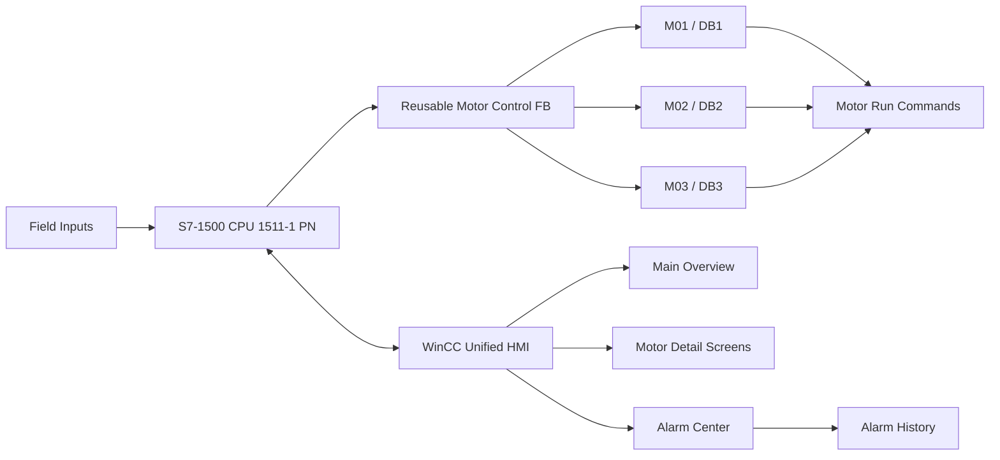

# Marine Auxiliary Fan Control & Monitoring System

A Siemens **S7-1500 + WinCC Unified** automation project for controlling and monitoring three marine auxiliary ventilation fans with reusable PLC logic, HMI remote control, diagnostics, and alarm history.

## Project Highlights

- Siemens **CPU 1511-1 PN**
- **TIA Portal V20 / STEP 7 Professional V20**
- **WinCC Unified V20**
- **S7-PLCSIM V20**
- MTP1000 Unified Comfort HMI project
- One reusable motor-control FB used by three motors
- Separate instance DBs for M01, M02 and M03
- Local / Remote operating logic
- START / STOP / RESET from HMI
- Permissives and interlocks
- Start failure detection
- Running feedback-loss detection
- Thermal fault latching and reset interlock
- Main overview + individual motor detail screens
- Discrete alarms and alarm history

## System Architecture



## PLC Design

The project uses a single reusable `Motor control` Function Block for all three fans.

| Motor | FB | Instance DB |
|---|---|---|
| M01 | Motor control | DB1 |
| M02 | Motor control | DB2 |
| M03 | Motor control | DB3 |

This avoids duplicating motor logic while preserving independent motor states, timers, memories and fault latches.

## Control and Diagnostics

Each motor includes:

- Local / Remote operating mode
- START / STOP / RESET
- Stop circuit, E-Stop, thermal and ready permissives
- Run command and run feedback
- Start Failure: no run feedback within ~3 s after start
- Running Feedback Loss: feedback lost for ~1 s after confirmed operation
- Thermal Fault: latched trip, reset permitted only after thermal condition is healthy again

## HMI

The WinCC Unified application includes:

- Main three-motor overview
- M01 / M02 / M03 detail screens
- RUNNING / READY / E-STOP OK / THERMAL OK status
- RUN COMMAND indication
- START / STOP / RESET controls
- Individual fault indication
- Screen navigation
- Alarm Center
- Alarm History

## Alarm System

Discrete alarms are configured for each motor:

- Start Failure
- Running Feedback Lost
- Thermal Fault

Cleared alarm events remain available in alarm history with timestamps and state changes.

## Testing

Validated using **S7-PLCSIM** and **WinCC Unified Runtime**:

- Healthy start / stop
- Start failure
- Running feedback loss
- Thermal trip
- Fault reset interlocks
- HMI remote START / STOP / RESET
- Independent M01 / M02 / M03 operation
- Overview/detail navigation
- Active alarms
- Alarm history logging

## Suggested Repository Layout

```text
marine-auxiliary-fan-control/
├─ README.md
├─ docs/
│  ├─ architecture.md
│  └─ screenshots/
├─ tia-project/
│  └─ README.md
└─ LICENSE
```

## Note

This is a simulation-based engineering portfolio project. Commissioning on real equipment would additionally require hardware-specific safety validation, protection review and field testing.
