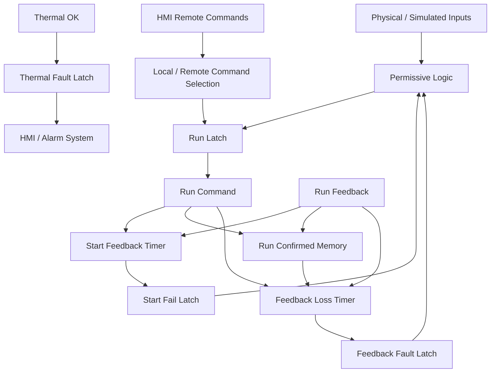

# Architecture Notes

## Key Engineering Decisions

- One reusable Function Block for three motors.
- Independent instance DBs preserve timers and latches.
- Remote commands use dedicated PLC tags rather than writing physical input addresses.
- Start failure and running feedback loss are separate fault modes.
- Thermal reset requires a healthy thermal input.
- Overview + detail HMI structure keeps navigation simple.
